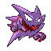
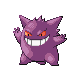
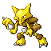

Sometimes, we will adjust the evolution method of a Pokémon to be different from base. There are two types of Evolution changes in Emerald Legacy: QoL, and Balance. 

**NOTE FOR EEVEE**: The time-based Eeveelutions, Espeon and Umbreon, are unchanged from Gen 3’s original system: Umbreon evolves in the AM hours and Espeon in the PM hours.

In the interest of promoting the single-player experience that ROMhacks favor, all trade evolutions are removed in favor of level-ups or, if the trade requires an item, using the item from your bag like a stone instead of the held method. As another QoL change from Crystal Legacy, Hitmontop has had its “balanced stats” evolution replaced with using the Brick Piece instead.

## List of evolution changes for singleplayer experience

| Prior | Way | Evolution To |
| :------: | :------: | :------: |
|  Haunter | Level 42 |  Gengar |
| Kadabra | Level 42   <small>Was: Trade</small> |  Alakazam |
| Graveler | Level 38   <small>Was: Trade</small> | Golem |
| Machoke | Level 38   <small>Was: Trade</small> | Machamp |
| Tyrogue | Use Item: Brick Piece   <small>Was: Lv20 w/ equal stats</small> | Hitmontop |
| Clamperl | Use Item: DeepSeaScale   <small>Was: Trade w/ item</small> | Gorebyss |
| Clamperl | Use Item: DeepSeaTooth   <small>Was: Trade w/ item</small> | Huntail |
| Seadra | Use Item: Dragon Scale   <small>Was: Trade w/ item</small> | Kingdra |
| Poliwhirl | Use Item: King's Rock   <small>Was: Trade w/ item</small> | Politoed |
| Slowpoke | Use Item: King's Rock   <small>Was: Trade w/ item</small> | Slowking |
| Onix | Use Item: Metal Coat   <small>Was: Trade w/ item</small> | Steelix |
| Scyther | Use Item: Metal Coat   <small>Was: Trade w/ item</small> | Scizor |
| Porygon | Use Item: Up-Grade   <small>Was: Trade w/ item</small> | Porygon2 |

## List of evolution changes for balance

Some Pokémon are strong enough to be valuable in a playthrough, but their evolution just comes too late to capitalize on that. In these situations, we use an earlier evolution level as a method of buffing that Pokémon so it can have an impact sooner. These same changes were also ported forward from Crystal Legacy as a parity measure, so some Pokémon have evolution changes despite not being usable until endgame.

| Prior | Way | Evolution To |
| :------: | :------: | :------: |
|  Haunter | Level 42 | 

 Gengar CHANGE ROW |
| Goldeen | Level 28   <small>Was: Level 33</small> | Seaking |
| Spinarak | Level 21   <small>Was: Level 22</small> | Ariados |
| Pineco | Level 25   <small>Was: Level 31</small> | Forretress |
| Slugma | Level 27   <small>Was: Level 38</small> | Magcargo |
| Ralts | Level 16   <small>Was: Level 20</small> | Kirlia |
| Aron | Level 28   <small>Was: Level 32</small> | Lairon |
| Meditite | Level 33   <small>Was: Level 37</small> | Medicham |
| Trapinch | Level 32   <small>Was: Level 35</small> | Vibrava |
| Vibrava | Level 42   <small>Was: Level 45</small> | Flygon |
| Snorunt | Level 36   <small>Was: Level 42</small> | Glalie |